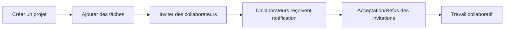
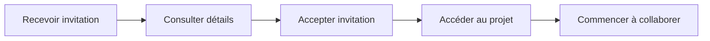

# 🤝 Guide de Collaboration - CollabWave

## Vue d'ensemble

Le système de collaboration de CollabWave permet aux utilisateurs de partager des projets entiers avec d'autres utilisateurs, avec un contrôle granulaire des permissions. Contrairement aux anciens systèmes qui partageaient des tâches individuelles, notre approche se base sur le **partage de projets complets**.

## 🎯 Concept Principal

### Philosophie du Partage de Projets

- **Projets comme unité de collaboration** : Toute la collaboration se fait au niveau du projet
- **Permissions héritées** : Les permissions sur un projet s'appliquent à toutes ses tâches
- **Gestion centralisée** : Un seul endroit pour gérer tous les collaborateurs d'un projet

### Hiérarchie des Accès

```
👑 Propriétaire (Créateur)
├── Accès complet au projet
├── Gestion des collaborateurs
└── Suppression du projet

👨‍💼 Admin (Invité avec droits admin)
├── Gestion des collaborateurs
├── Modification complète des tâches
└── Gestion des catégories du projet

✏️ Éditeur (Droits de modification)
├── Création/modification/suppression de tâches
├── Modification des catégories
└── Lecture de toutes les données

👁️ Lecteur (Lecture seule)
├── Visualisation de toutes les tâches
├── Visualisation des catégories
└── Aucune modification possible
```

## 🚀 Fonctionnalités de Collaboration

### 1. Partage de Projets

#### Comment partager un projet :

1. Accédez à la page **Projets** (`/projects`)
2. Cliquez sur le bouton **👥** (Gérer les collaborateurs) sur votre projet
3. Cliquez sur **Inviter** dans le modal
4. Saisissez l'email de l'utilisateur à inviter
5. Choisissez le niveau de permission
6. Ajoutez un message personnalisé (optionnel)
7. Envoyez l'invitation

#### Permissions disponibles :

- **👁️ Lecture seule** : Peut voir les tâches mais pas les modifier
- **✏️ Modification** : Peut créer, modifier et supprimer des tâches
- **👑 Administration** : Droits complets, peut inviter d'autres utilisateurs

### 2. Gestion des Invitations

#### Invitations envoyées :

- Visibles dans le modal de collaboration du projet
- Statut "En attente" affiché en jaune
- Possibilité d'annuler une invitation non acceptée

#### Invitations reçues :

- Accessibles via **📨 Invitations** dans le menu
- Détails du projet et de l'inviteur affichés
- Options : **Accepter** ou **Refuser**
- Message personnalisé du l'inviteur (si fourni)

### 3. Système de Notifications

#### Types de notifications :

- **📨 Invitation reçue** : Nouvelle invitation de collaboration
- **✅ Invitation acceptée** : Quelqu'un a accepté votre invitation
- **❌ Invitation refusée** : Quelqu'un a refusé votre invitation
- **🤝 Projet partagé** : Accès accordé à un nouveau projet
- **📝 Tâche mise à jour** : Modification dans un projet partagé
- **🚪 Accès retiré** : Suppression de l'accès à un projet

#### Gestion des notifications :

- Badge rouge sur le lien **Notifications** s'il y a des non-lues
- Clic sur une notification la marque comme lue
- Bouton "Tout marquer comme lu" disponible

## 📋 Workflows Typiques

### Workflow 1 : Créer et Partager un Projet



1. **Créateur** : Crée un nouveau projet avec description et couleur
2. **Créateur** : Ajoute des tâches initiales au projet
3. **Créateur** : Invite des collaborateurs avec permissions appropriées
4. **Invités** : Reçoivent notifications et invitations
5. **Invités** : Acceptent ou refusent les invitations
6. **Équipe** : Travaille ensemble sur le projet partagé

### Workflow 2 : Rejoindre un Projet Existant



1. **Invité** : Reçoit une notification d'invitation
2. **Invité** : Consulte les détails dans **📨 Invitations**
3. **Invité** : Accepte l'invitation
4. **Invité** : Le projet apparaît dans sa liste de projets
5. **Invité** : Peut commencer à travailler selon ses permissions

## 🔧 APIs de Collaboration

### Projets

- `GET /api/projects` - Liste tous les projets (possédés + partagés)
- `POST /api/projects` - Créer un nouveau projet
- `GET /api/projects/[id]` - Détails d'un projet
- `PUT /api/projects/[id]` - Modifier un projet (admin requis)
- `DELETE /api/projects/[id]` - Supprimer un projet (propriétaire requis)

### Partage de Projets

- `GET /api/projects/[id]/share` - Liste des collaborateurs et invitations
- `POST /api/projects/[id]/share` - Inviter un utilisateur
- `DELETE /api/project-shares/[id]` - Retirer un collaborateur

### Invitations

- `GET /api/invitations` - Invitations reçues par l'utilisateur
- `PUT /api/invitations/[id]` - Accepter/refuser une invitation
- `DELETE /api/invitations/[id]` - Supprimer/annuler une invitation

### Notifications

- `GET /api/notifications` - Notifications de l'utilisateur
- `PUT /api/notifications/[id]` - Marquer une notification comme lue
- `PUT /api/notifications/mark-all-read` - Marquer toutes comme lues

## 🎨 Interface Utilisateur

### Page Projets (`/projects`)

- **Cartes de projets** avec indicateurs de partage
- **Bouton de collaboration** (👥) pour les propriétaires/admins
- **Badges de permissions** pour les projets partagés
- **Statistiques** : nombre de tâches, collaborateurs, etc.

### Modal de Collaboration

- **Liste des collaborateurs** avec leurs permissions
- **Invitations en attente** avec statut
- **Formulaire d'invitation** avec sélection de permissions
- **Actions** : inviter, retirer, annuler invitations

### Page Invitations (`/invitations`)

- **Cartes d'invitations** avec détails complets
- **Informations du projet** : nom, description, créateur
- **Message personnalisé** de l'inviteur
- **Actions** : accepter, refuser

### Page Notifications (`/notifications`)

- **Timeline des notifications** avec icônes par type
- **Indicateur de lecture** (point bleu pour non-lues)
- **Formatage intelligent** des dates (relative)
- **Badge de compteur** non-lues dans la navbar

## 🔒 Sécurité et Permissions

### Contrôles d'Accès

- **Authentification requise** pour toutes les APIs
- **Vérification des permissions** à chaque opération
- **Isolation des données** par utilisateur et projet
- **Validation des entrées** et sanitisation

### Règles de Permissions

1. **Propriétaire** : Accès complet, ne peut pas être retiré
2. **Admin** : Peut tout faire sauf supprimer le projet
3. **Éditeur** : Peut modifier le contenu mais pas les collaborateurs
4. **Lecteur** : Lecture seule, aucune modification

### Validation des Invitations

- **Email valide** requis pour les invitations
- **Utilisateur existant** vérifié lors de l'invitation
- **Pas de double invitation** pour le même email/projet
- **Auto-création de notification** lors de l'envoi

## 📊 Données de Test

Pour tester le système, utilisez :

```bash
npm run db:seed-collab
```

Cela crée :

- **3 utilisateurs** : Alice, Bob, Charlie
- **3 projets** avec différents propriétaires
- **Collaborations existantes** : Bob sur projet d'Alice, Charlie sur projet de Bob
- **Invitations en attente** : Charlie→Alice, Alice→Charlie
- **Notifications** pour chaque utilisateur

### Comptes de Test

- **alice@example.com** / password123
- **bob@example.com** / password123
- **charlie@example.com** / password123

## 🚀 Migration depuis l'Ancien Système

### Changements Majeurs

1. **Suppression de `TodoShare`** : Plus de partage de tâches individuelles
2. **Ajout de `ProjectShare`** : Partage au niveau projet
3. **Nouveau système d'invitations** : Plus robuste et centré utilisateur
4. **Notifications enrichies** : Tous les événements de collaboration

### Avantages

- **Gestion simplifiée** : Un seul endroit pour les permissions
- **Sécurité renforcée** : Contrôle granulaire mais cohérent
- **Expérience utilisateur** : Interface intuitive et moderne
- **Scalabilité** : Adapté aux équipes de toute taille

---

## 🤔 FAQ

**Q: Peut-on partager une seule tâche ?** R: Non, le partage se fait uniquement au niveau projet. Créez un projet dédié si nécessaire.

**Q: Combien de collaborateurs maximum ?** R: Aucune limite technique, mais pour l'UX il est recommandé de rester raisonnable.

**Q: Les invitations expirent-elles ?** R: Non, elles restent en attente jusqu'à acceptation/refus/annulation.

**Q: Peut-on changer les permissions d'un collaborateur ?** R: Actuellement non, il faut le retirer et le ré-inviter. Fonctionnalité à venir.

**Q: Les collaborateurs voient-ils toutes les catégories ?** R: Oui, toutes les données du projet sont partagées selon les permissions.

---

_Dernière mise à jour : 26 mai 2025_
